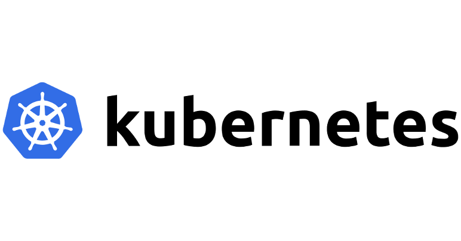

# Creating Local Development Environment for JenkinsX and Kubernetes

#  Features!

  - AWS CLI Setup
  - kubernetes-CLI Setup
  - KOPS Setup
  - kube-config Setup
  - JenkinsX Setup

### How to run

Pick the most suitable instructions for your operating system:
* macOS
* Linux

Run

* chmod +x setupBot.sh
* ./setupBot.sh

##### The purpose of this script is to simplify local dev env setup. 

----
Want to contribute? Great!
 - [Connect ->  Hariom Vashisth](mailto:hariom.devops@gmail.com)

